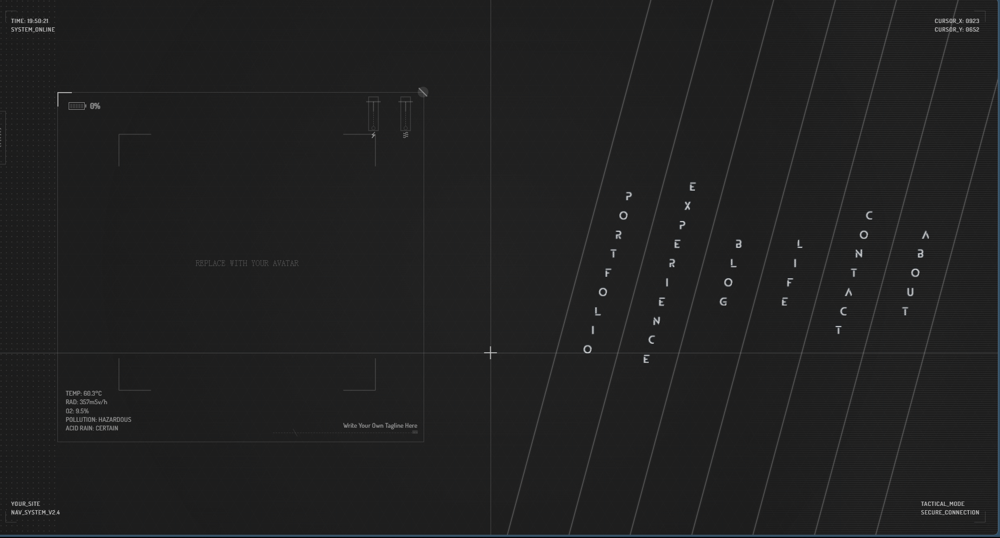

**中文** | [English](./README.en.md)

# RAINMORIME Template

你的个人网站不需要看起来像其他所有人的个人网站。

这是一个后末日科幻 HUD 风格的作品集 + 博客模板。没有卡片瀑布流，没有渐变大标题——打开它的时候，你会看到扫描线、心电图、雷达，和一个正在逐字斟酌措辞的 AI。

> **[在线演示 →](https://rainmorime.com)**


<!-- 🖼️ 建议替换为 GIF（15 秒以内，展示悬停动画 + 页面切换效果更好） -->

## 开始使用

```bash
git clone https://github.com/RainMorime/rainmorime-template.git
cd rainmorime-template
npm install
cp .env.example .env.local
npm run dev
```

打开 `http://localhost:3000`，你会看到加载动画，然后是五列导航。接下来要做的就是把模板里的占位内容换成你自己的。

## 把它变成你的

### 第一步：基本信息

这些是你**必须**改的地方，否则网站上会显示 "YOUR_SITE" 和 "your-email@example.com"：

| 要改什么 | 在哪里 | 改成什么 |
|---------|--------|---------|
| 站名 | `components/layout/GlobalHud.tsx` | 搜索 `YOUR_SITE`，换成你的站名 |
| 加载标题 | `components/shared/LoadingScreen/LogoTitle.tsx` | 同上 |
| 邮箱 | `components/sections/ContactSection.tsx` | 搜索 `your-email@example.com` |
| 邮箱（复制） | `pages/content.tsx` | 搜索 `your-email@example.com` |
| 版权 | `components/sections/AboutSection.tsx` | 搜索 `Your Name` |
| 头像 | `public/avatar.svg` | 替换为你的头像图片 |
| 打字签名 | `hooks/useTypingEffect.ts` | 修改 `englishText` 和 `chineseText` |

### 第二步：填充内容

`data/` 目录是你所有内容的数据源，格式是普通的 TypeScript 数组，照着示例改就行：

| 文件 | 内容 |
|------|------|
| `data/projects.ts` | 你的项目和作品 |
| `data/experience.ts` | 教育和工作经历 |
| `data/life.ts` | 游戏、旅行、日常 |
| `data/skills.ts` | 技能树 |
| `data/friendLinks.ts` | 友情链接 |

### 第三步：写博客

在 `content/blog/` 里创建 `.mdx` 文件：

```markdown
---
title: "文章标题"
date: "2025-01-01"
excerpt: "一段简短描述"
tags: ["标签1", "标签2"]
---

正文用 Markdown 写。支持代码高亮、图片、自定义组件。
```

### 第四步：其他可选配置

<details>
<summary><b>音乐播放器</b></summary>

编辑 `components/interactive/MusicPlayer.tsx` 顶部的 `playlist` 数组，把音频文件放到 `public/music/`。支持 `.mp3` 和外链。

</details>

<details>
<summary><b>配色</b></summary>

主色调是 `styles/globals.scss` 里的 `--ark-highlight-green: #b2f2bb`。改这一个变量就能改全站的绿。

负色（拉杆切换的粉色模式）用的是 `--ark-inverted-*` 系列变量，在同一个文件里。

</details>

<details>
<summary><b>环境变量</b></summary>

```env
PORT=3000                              # 服务端口，默认 3000
NEXT_PUBLIC_SITE_URL=https://你的域名   # 用于 sitemap 和 RSS
```

</details>

<details>
<summary><b>部署</b></summary>

```bash
npm run build
npm start          # 或用 PM2：
pm2 start server.js --name my-site
```

自带 SSE 实时统计（访客数 + 在线人数 + 运行时长），不需要额外数据库。统计数据持久化在项目根目录的 `.stats.json` 文件中。

</details>

## 功能一览

- 42 个手写 CSS 动画（扫描线 / 心电图 / 雷达 / 聚焦框 / 任务列表...）
- 电源系统：拉杆切换全站负色模式
- AI 风格的打字机效果
- 五列导航，每列有独立的悬停动画
- WebGL 雨粒子背景（延迟加载，不影响首屏）
- MDX 博客 + RSS + 自动阅读时长
- SSE 实时访客统计
- 黑胶唱片音乐播放器
- 移动端完整适配

<!-- 🖼️ 功能截图（悬停动画 / 负色模式 / 移动端 各一张） -->
<!-- | 悬停动画 | 负色模式 | 移动端 |
|---------|---------|--------|
|  |  |  | -->

## 技术栈

Next.js 14 · TypeScript · SCSS Modules · CSS @keyframes · Framer Motion · GSAP · Three.js · MDX · Node.js SSE

## 项目结构

```
├── pages/              # 页面路由
├── components/
│   ├── layout/         # 布局（导航、HUD、左面板）
│   ├── sections/       # 内容区（Works / Experience / Life / Contact / About）
│   ├── detail/         # 详情视图
│   ├── effects/        # 视觉效果（WebGL、噪点、3D）
│   ├── interactive/    # 交互组件（音乐播放器、灯箱、拉杆）
│   └── shared/         # 通用组件
├── hooks/              # 自定义 Hooks
├── contexts/           # 全局状态
├── data/               # ← 你的内容在这里
├── content/blog/       # ← 你的博客在这里
├── styles/             # SCSS 样式
└── server.js           # 自定义服务器（SSE 统计）
```

## 许可证

[MIT](./LICENSE) — 免费使用，保留署名即可。

---

设计与开发：[RainMorime](https://github.com/RainMorime)
